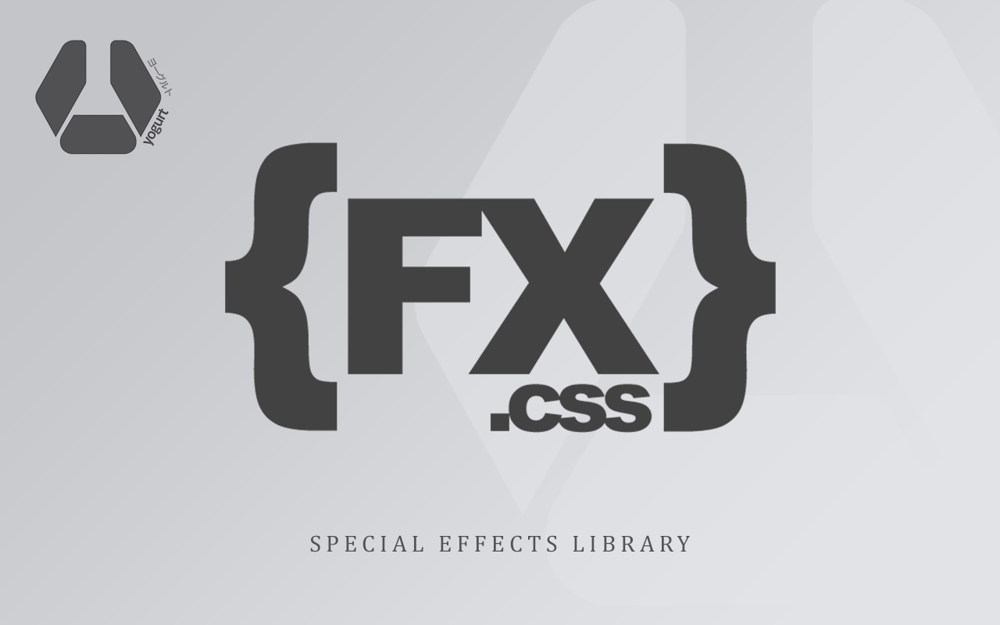

<p align="center">
  
</p>

<p align="left">
  
  
  
  
  
  
  
  
  
  
  
</p>

> A complete set of CSS animations utility for web UI, (FX, aka `Special Effect`).

> Work in progress

Yogurt `{FX}.motion` started out as a small side-project of mine. As I was increasingly using CSS animations, I thought it would come in handy to have them organized in a meaningful and accessible way so that they can be easily reused on different projects.

I have been using `{FX}.motion` for a while now and I hope some of you will find it useful as well. It is still very much a work in progress and hopefully it will evolve over the time.

Below are my special collection of css animation over the years in 7 different main presets.

---

#### {basic}

> **(!!)** this preset has completed

- scale-up`(15)`, scale-down`(15)`, rotate`(21)`, rotate-scale`(10)`, rotate-90`(22)`, flip`(16)`, flip-scale`(8)`, swing`(16)`, slide`(8)`, slide-backward`(9)`, slide-forward`(9)`, slide-rotate`(12)`, shadow-drop`(11)`, shadow-pop`(4)`, shadow-inset`(11)`

> (total) 15 modules, 187 effects

#### todo/{entrances}

- scale-in, rotate-in, swirl-in, flip-in, slit-in, slide-in, slide-in-forward, slide-in-backward, slide-in-blurred, slide-in-elliptic, bounce-in, roll-in, roll-in-blurred, tilt-in, tilt-in-forward, swing-in, fade-in, puff-in, flicker-in

#### todo/{exits}

- scale-out, rotate-out, swirl-out, flip-out, slit-out, slide-out, slide-out-backward, slide-out-forward, slide-out-blurred, slide-out-elliptic, bounce-out, roll-out, roll-out-blurred, swing-out, fade-out, puff-out, flicker-out

#### todo/{text}

- tracking-in, tracking-out, focus-in, blur-out, flicker, shadow-drop, shadow-pop, pop-up

#### todo/{attention}

- vibrate, flicker, shake, jello, wobble, bounce, pulsate, blink

#### todo/{background}

- ken-burns, bg-pan, color-change

---

## _manage

you can `enable` or `disable` the `presets` or `modules` that you don't want to included in the build with **comment out** them to suite your need,

- to customize presets, look for file `fx-motion.scss`.
- to customize modules, look for file `_modules.scss`.
- to customize effects, look for file `_effects.scss`.

---

## _introduction

> **(!!)** there are so much to do to make the class name easy to use.

the class name is always start with a prefix `fx:motion:`, following with the module name e.g. `flip:`, lastly the effect name e.g. `vertical-left`.

## _usage

let's take an example of **{basic}** preset pack that comes with **{flip}** effect module, this add animation to the element,

```html
<div class="fx:motion:flip:vertical-left">
  This is a text!
</div>
```

---

## _using via cdn

```html
<link defer href="https://unpkg.com/fx-motion@1.0.0/dist/fx-motion.css" 
      rel="stylesheet"
      rel="preload"
      as="style"
      media="all">
```

## _using via build

``` bash
# install dependencies
$ npm install

# build for production
$ npm run build
```

---

[MIT](https://github.com/yogurt-foundation/fx-motion/blob/master/LICENSE)


