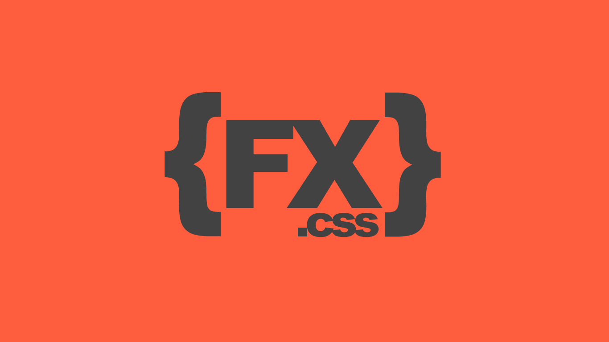

<p align="left">
  
</p>

# {FX}.css

> (work in progress) A complete set of CSS animation (FX, aka Special Effect`) utility for web UI.

`{FX}.css` is a library where you can play with a collection of pre-made css animations.

`{FX}.css` started out as a small side-project of mine. As I was increasingly using CSS animations, I thought it would come in handy to have them organised in a meaningful and accessible way so that they can be easily reused on different projects.

I have been using `{FX}.css` for a while now and I hope some of you will find it useful as well. It is still very much a work in progress and hopefully it will evolve over the time :)

## _todo

Below are my special collection of css animation made by me over the years in 6 different main presets.

#### basic

> **(!!)** this preset has completed

- scale-up`(15)`, scale-down`(15)`, rotate`(21)`, rotate-scale`(10)`, rotate-90`(22)`, flip`(16)`, flip-scale`(8)`, swing`(16)`, slide`(8)`, slide-backward`(9)`, slide-forward`(9)`, slide-rotate`(12)`, shadow-drop`(11)`, shadow-pop`(4)`, shadow-inset`(11)`

> (total) 15 modules, 187 effects

#### entrances

- scale-in, rotate-in, swirl-in, flip-in, slit-in, slide-in, slide-in-forward, slide-in-backward, slide-in-blurred, slide-in-elliptic, bounce-in, roll-in, roll-in-blurred, tilt-in, tilt-in-forward, swing-in, fade-in, puff-in, flicker-in

#### exits

- scale-out, rotate-out, swirl-out, flip-out, slit-out, slide-out, slide-out-backward, slide-out-forward, slide-out-blurred, slide-out-elliptic, bounce-out, roll-out, roll-out-blurred, swing-out, fade-out, puff-out, flicker-out

#### text

- tracking-in, tracking-out, focus-in, blur-out, flicker, shadow-drop, shadow-pop, pop-up

#### attention

- vibrate, flicker, shake, jello, wobble, bounce, pulsate, blink

#### background

- ken-burns, bg-pan, color-change

---

## _setup

``` bash
# install dependencies
$ npm install

# build for production
$ npm run build
```

---

MIT License

Copyright (c) 2020 Loouis Low

Permission is hereby granted, free of charge, to any person obtaining a copy
of this software and associated documentation files (the "Software"), to deal
in the Software without restriction, including without limitation the rights
to use, copy, modify, merge, publish, distribute, sublicense, and/or sell
copies of the Software, and to permit persons to whom the Software is
furnished to do so, subject to the following conditions:

The above copyright notice and this permission notice shall be included in all
copies or substantial portions of the Software.

THE SOFTWARE IS PROVIDED "AS IS", WITHOUT WARRANTY OF ANY KIND, EXPRESS OR
IMPLIED, INCLUDING BUT NOT LIMITED TO THE WARRANTIES OF MERCHANTABILITY,
FITNESS FOR A PARTICULAR PURPOSE AND NONINFRINGEMENT. IN NO EVENT SHALL THE
AUTHORS OR COPYRIGHT HOLDERS BE LIABLE FOR ANY CLAIM, DAMAGES OR OTHER
LIABILITY, WHETHER IN AN ACTION OF CONTRACT, TORT OR OTHERWISE, ARISING FROM,
OUT OF OR IN CONNECTION WITH THE SOFTWARE OR THE USE OR OTHER DEALINGS IN THE
SOFTWARE.
